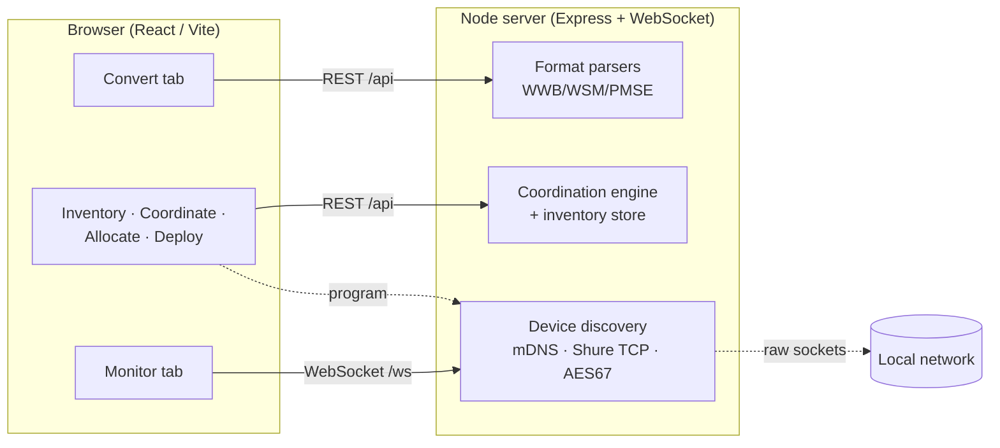
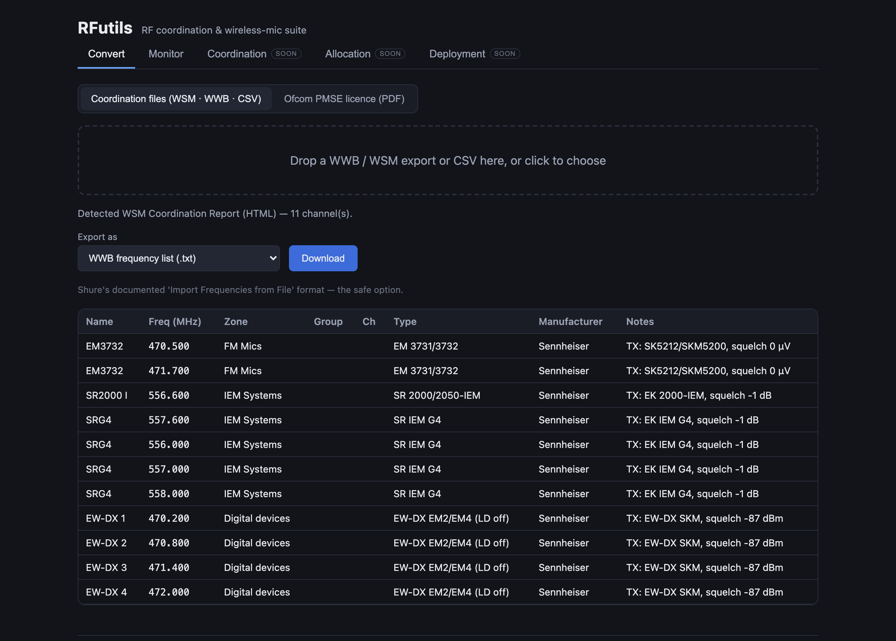
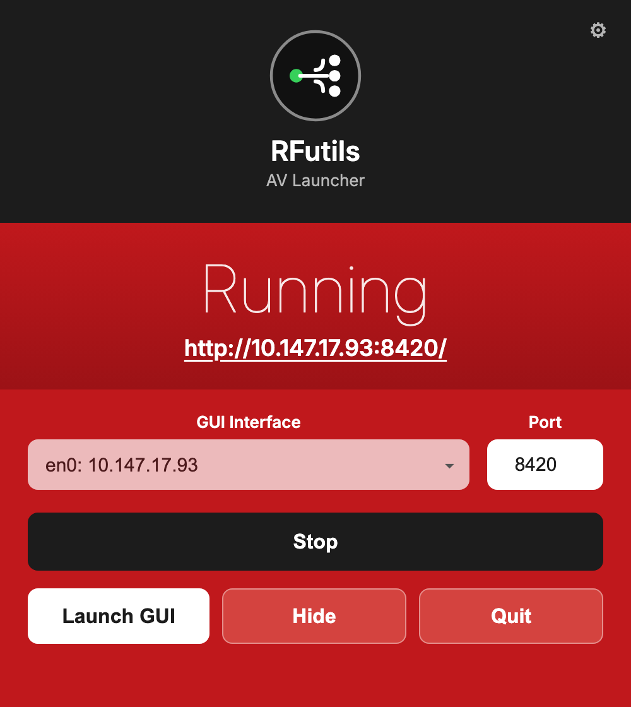
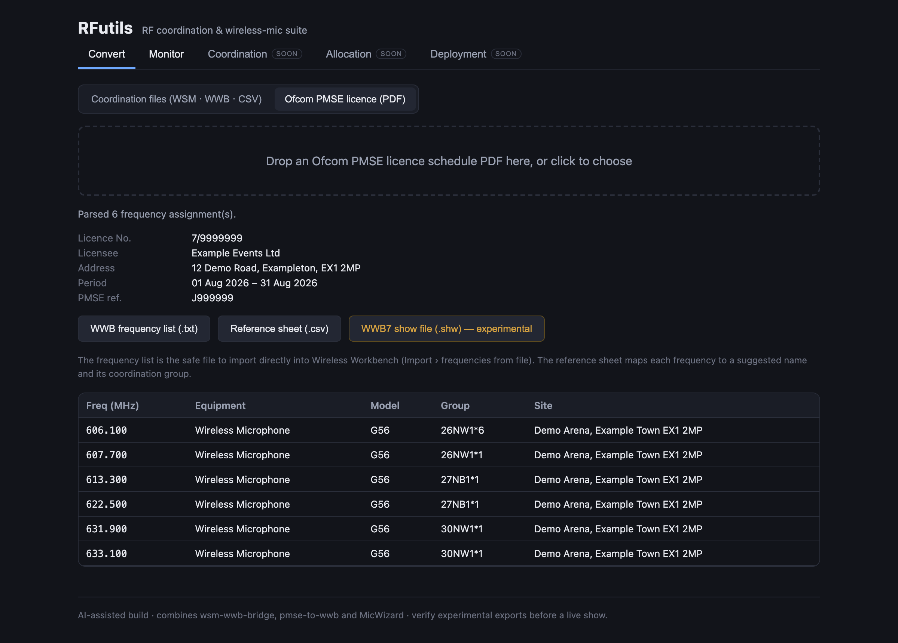
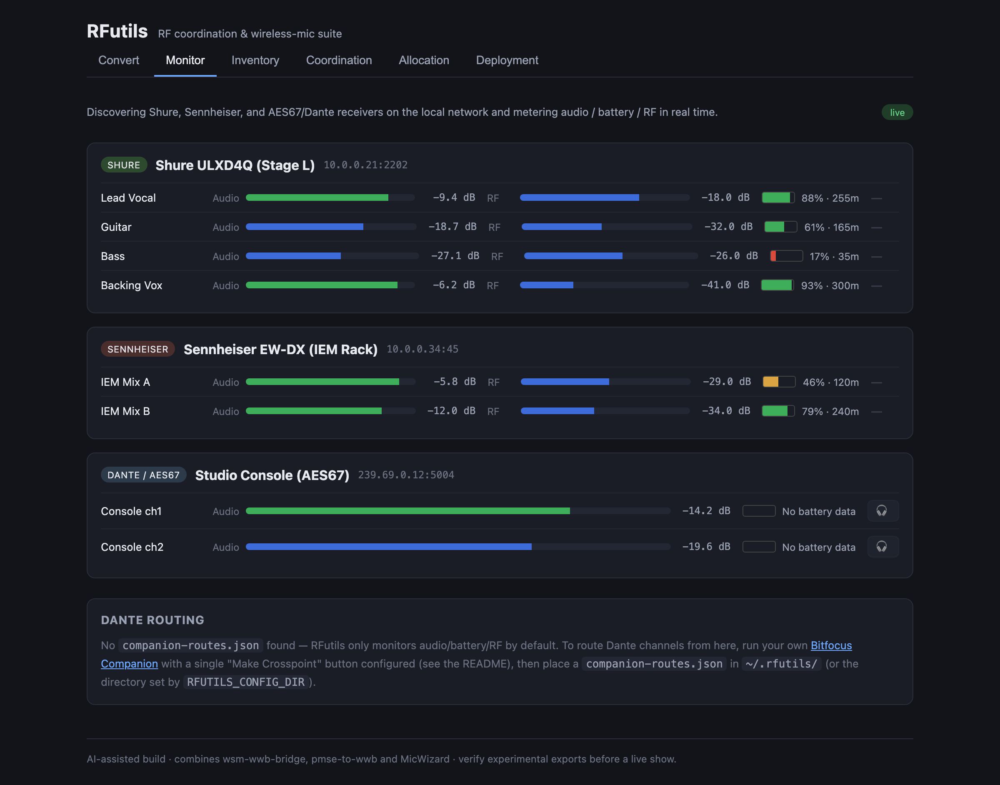
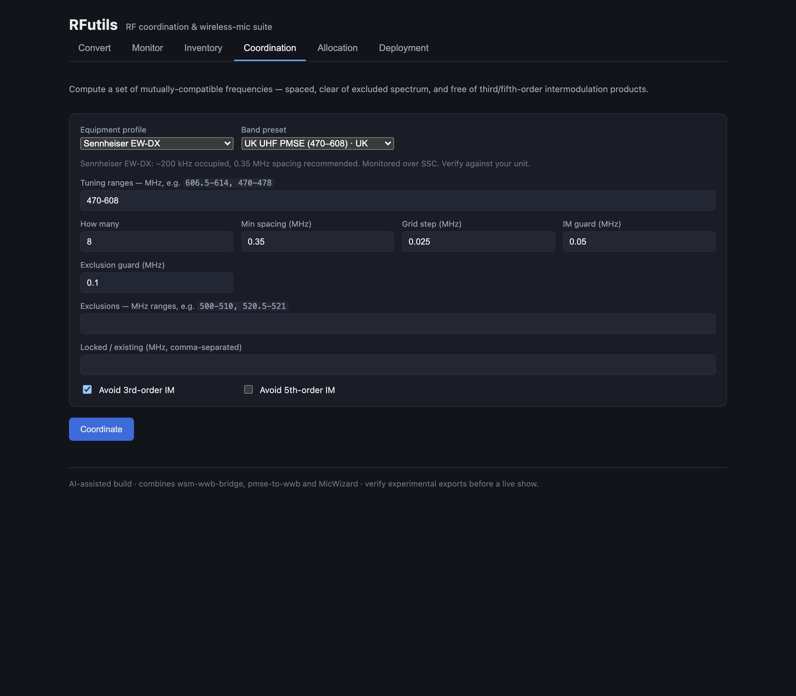
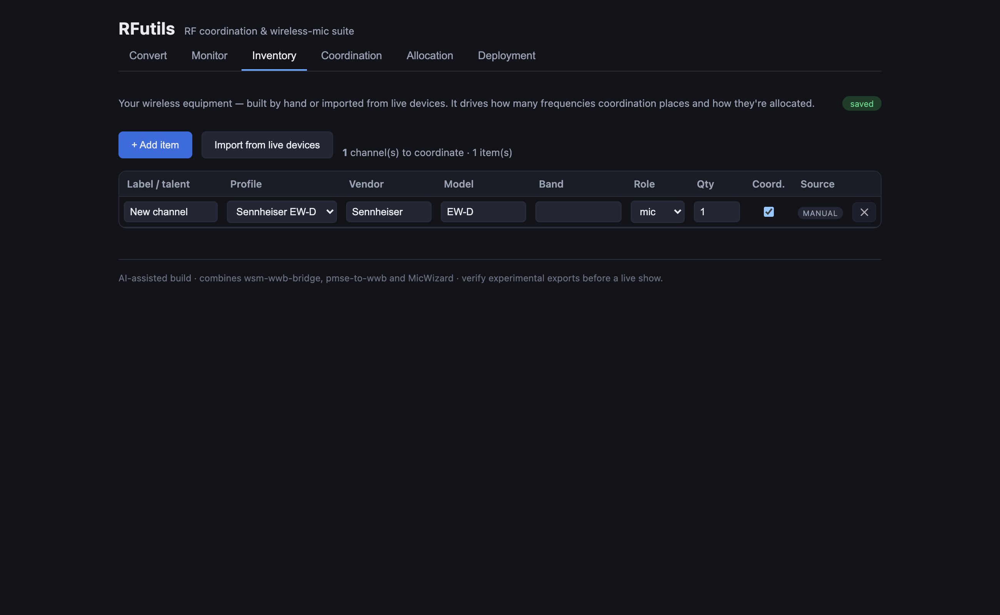
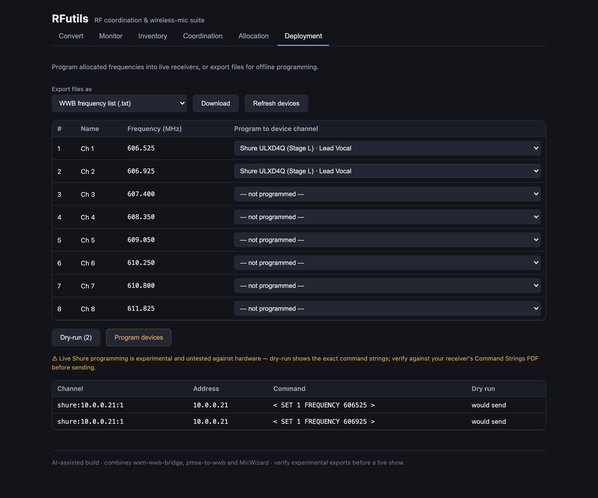

# RFutils

> **AI-assisted project.** This codebase was created with [Claude Code](https://claude.com/claude-code)
> (Anthropic), directed and reviewed by a human author. It merges three earlier tools into one
> package; several of the underlying formats and protocols are reverse-engineered from real exports
> and vendor gear rather than official schemas (neither Shure nor Sennheiser publish full specs for
> most of these). **Verify every export against your own WWB/WSM install, and check experimental
> outputs carefully, before relying on any of this for a live show.**

A browser-based RF-coordination and wireless-mic suite that unifies three separate tools into one
package, with room to grow into full frequency coordination, allocation, and deployment services:

| Merged tool | What it did | Where it lives now |
|---|---|---|
| [wsm-wwb-bridge](https://github.com/stoatworks-labs/wsm-wwb-bridge) | Move coordination data between Shure Wireless Workbench (WWB) and Sennheiser Wireless Systems Manager (WSM), plus any CSV | **Convert › Coordination files** |
| [pmse-to-wwb](https://github.com/stoatworks-labs/pmse-to-wwb) | Convert an Ofcom PMSE licence schedule PDF into WWB import files | **Convert › Ofcom PMSE licence** |
| [MicWizard](https://github.com/stoatworks-labs/MicWizard) | Discover networked Shure/Sennheiser/AES67 receivers and monitor audio / battery / RF | **Monitor** |



Everything routes through **one internal channel model** (`packages/shared`), so any supported input
can be re-exported as any supported output, and the same model feeds coordination, allocation, and
deployment.



## Architecture

An npm-workspaces monorepo:

- **`packages/shared`** — the internal data model and wire types shared by server and browser
  (`Channel` / `CoordinationList`, PMSE `Assignment`, `DiscoveredDevice`, the WebSocket protocol).
- **`packages/server`** — a Node ([Express](https://expressjs.com) + [ws](https://github.com/websockets/ws))
  server. It does the file parsing/exporting (ported from the two Python tools) **and** owns the raw
  sockets a browser can't open: mDNS, Shure's TCP command protocol, and AES67/SAP multicast.
- **`packages/web`** — the React/Vite single-page app (ported from MicWizard's renderer plus new
  conversion UI).

The two file tools were originally Python (a tkinter desktop app and a FastAPI service); their
parsers were ported to TypeScript and checked against the original tools' output on real sample
files (see `packages/server/scripts/verifyParsers.ts`). MicWizard's networking was already
TypeScript and moved from its Electron main process into this server largely intact.

## Running it

Requires Node 18+ (developed against Node 22/26).

```bash
npm install
npm run dev          # server on :8420, web on :5273 (Vite proxies /api and /ws to the server)
```

Then open http://localhost:5273.

For a production build served from a single port:

```bash
npm run build
npm start -w @rfutils/server   # serves the built UI + API on :8420
```

Other scripts: `npm run typecheck` (all packages), `npm test` (server parser tests),
`npm run dev:demo` (like `dev`, but seeds simulated receivers so the Monitor tab is populated
without any hardware — how the Monitor screenshot above was captured).

### Environment

- `RFUTILS_SERVER_PORT` — server port (default `8420`).
- `RFUTILS_DISABLE_MONITOR=1` — skip network device discovery (file conversion still works).
- `RFUTILS_MOCK_DEVICES=1` — seed simulated receivers into the Monitor dashboard (demo/dev).
- `RFUTILS_CONFIG_DIR` — where `companion-routes.json` is read from (default `~/.rfutils`).
- `RFUTILS_CAPTURE_DEVICE` / `_FORMAT` / `_CHANNEL` / `_RATE`, `RFUTILS_FFMPEG`,
  `RFUTILS_CAPTURE_CMD`, `RFUTILS_CUE_BUS_DEVICE` / `_CHANNEL`, `RFUTILS_CUE_SRC_DEVICE` — audio
  capture (DVS/Dante interface) cue mode; see [Audio cueing](#audio-cueing-to-headphones).

### Desktop app

Prefer not to touch the terminal? A small menu-bar app lets you pick the network
interface + port, Start/Stop the server, and open the web UI. It's **fully
self-contained** — the `.dmg` embeds a Node runtime plus the whole app (server +
built web UI), so nothing needs to be installed, not even Node. Grab it from
[Releases](https://github.com/stoatworks-labs/RFutils/releases), or see
[launcher/](launcher/) to build it. The `.dmg` is **unsigned** (a signed +
notarized build needs a paid Apple Developer account) — on first launch,
right-click the app → **Open** to get past Gatekeeper. If you ever get a
Developer account, [launcher/SIGNING.md](launcher/SIGNING.md) shows how to turn
signing on; until then it's not needed.

<p align="center"></p>

## Convert

### Coordination files (WSM · WWB · CSV)

Drop a file and RFutils auto-detects its shape, previews the parsed channels, and lets you
re-export to any supported format:

**Reads:** Shure `.shw` / `.cws` (native WWB XML), Sennheiser `.wsm` project files, WSM HTML
"Coordination Report", WSM Frequencies/Bands CSV, WWB Coordination Report CSV, a bare frequency
list, or any other CSV via a column-mapping dialog.

**Writes:** WWB frequency list (`.txt`, the safe documented import format), WWB inventory CSV,
WSM Frequencies/Bands CSV, a generic CSV, or an experimental WWB7 `.shw` show file.

### Ofcom PMSE licence (PDF)

Upload an Ofcom PMSE licence schedule PDF to generate a WWB frequency list (`.txt`), a reference
sheet (`.csv`) mapping frequencies to suggested names and coordination groups, and an experimental
`.shw` show file.



*Screenshot uses a synthetic licence with invented details — not a real licence.*

> **PDF parsing.** The original `pmse-to-wwb` used Python's `pdfplumber` for table detection.
> `pdfjs-dist` has no table detector, so this port buckets positioned text into the fixed Ofcom
> ST16 template's columns (scaled by page width) and merges the multiple physical lines per row.
> It's been validated against a real Ofcom PMSE licence schedule — all 116 assignments,
> frequencies, sites, periods, fees and header metadata parse correctly. The column geometry is
> calibrated to that fixed template; a materially different Ofcom template revision would need
> re-calibration, so it's still wise to sanity-check the parsed assignments against the source PDF.

> ⚠️ The `.shw` show file (both here and in the coordination exporter) is reverse-engineered from a
> single real WWB7 file and unvalidated by Shure. Open it in Wireless Workbench and check it before
> relying on it for a real show; when in doubt, use the frequency list.

## Monitor

Live discovery and metering of wireless receivers on the local network — Shure (TCP command
strings, port 2202), Sennheiser (SSC), and AES67/Dante (mDNS + SAP), with per-channel audio,
battery, and RF telemetry pushed to the browser over WebSocket.



*Screenshot captured with `RFUTILS_MOCK_DEVICES=1` (simulated receivers) — no real hardware was on the network. The highlighted headphone button on an AES67 channel is an active audio cue.*

> **Not yet hardware-tested.** As in MicWizard, the vendor protocol adapters are built from a mix of
> public documentation and best-effort reverse engineering and have not been validated against real
> receivers. The Sennheiser SSC adapter in particular is a skeleton.

### Audio cueing to headphones

A browser can't join a Dante/AES67 multicast group directly, so cueing to headphones works by
**relay**: the server sends the one cued channel to the browser as PCM16 mono over a dedicated
binary WebSocket (`/ws/audio`), and an `AudioWorklet` ring buffer plays it out with a small jitter
buffer. Only the cued channel is streamed (~0.77 Mbit/s at 48 kHz), and only one is cued at a time,
like a hardware PFL/cue bus. There are two ways to get the audio into the server:

**1. Capture mode — a Dante interface (DVS) + Companion (recommended).** Let a vendor Dante
endpoint do the decode and let Companion do the routing:

```
Mic TX ──(Dante)──▶ [Companion re-points one crosspoint] ──▶ DVS / Dante interface "cue" Rx channel
                                                                       │  (local audio device)
                                                                       ▼
                                    RFutils server captures that channel with ffmpeg ──PCM16/WS──▶ browser 🎧
```

Clicking 🎧 on any channel best-effort asks Companion to route it to the cue-bus destination, then
streams the captured bus. This offloads the Dante decode to supported vendor software and reuses the
Companion integration below. Enable it by pointing the server at the interface's input:

- `RFUTILS_CAPTURE_DEVICE` — ffmpeg input device (e.g. `":2"` for an avfoundation index on macOS;
  list devices with `ffmpeg -f avfoundation -list_devices true -i ""`). Setting this switches the
  app into capture mode, and **every** channel becomes cueable.
- `RFUTILS_CAPTURE_FORMAT` — ffmpeg input format (default `avfoundation`/`dshow`/`alsa` by OS).
- `RFUTILS_CAPTURE_CHANNEL` — 0-based input channel to use as the cue bus (default `0`).
- `RFUTILS_CAPTURE_RATE` — sample rate (default `48000`); `RFUTILS_FFMPEG` — ffmpeg path.
- `RFUTILS_CAPTURE_CMD` — full override: any command emitting `s16le` mono to stdout (bypasses the
  ffmpeg args above). `npm run dev:capture-demo` uses this with a `sox` test tone.
- `RFUTILS_CUE_BUS_DEVICE` / `RFUTILS_CUE_BUS_CHANNEL` — the Dante Controller destination Companion
  routes mics to (the DVS Rx channel the server captures). Without these, cueing just streams the
  bus and you route manually. The source name sent to Companion is the discovered channel's name
  (override the device with `RFUTILS_CUE_SRC_DEVICE`); **these must match your Dante Controller
  labels** for auto-routing to hit the right crosspoint. ffmpeg needs installing (`brew install
  ffmpeg`). A fast/bursty source is throttled to real time by a server-side pacer.

**2. Direct AES67 mode (default, no config).** If no capture device is set, the server decodes
AES67 multicast itself and 🎧 plays that channel's own audio. Cueable **AES67 channels only** —
Shure/Sennheiser command protocols carry telemetry, not audio, and native-only Dante still needs
Audinate's SDK, so a Dante device must be in AES67 mode.

**Both modes** share the same PCM16/WebSocket/AudioWorklet playback path, verified end-to-end with a
synthetic tone (the browser analyser reads the expected level) — direct mode via
`RFUTILS_MOCK_DEVICES`, capture mode via `dev:capture-demo`. Latency is ~100–200 ms (fine for
identifying a mic, not for sample-accurate work); lower-latency Opus/WebRTC transport is a natural
future upgrade. The real-Dante decode / capture-device paths remain hardware-untested.

### Dante routing via Companion (optional)

Off by default. To route Dante crosspoints from the Monitor tab, run your own
[Bitfocus Companion](https://bitfocus.io/companion) with a single "Make Crosspoint" button wired to
`companion-module-audinate-dantecontroller`, then copy `companion-routes.example.json` to
`~/.rfutils/companion-routes.json` (or `$RFUTILS_CONFIG_DIR`). RFutils just sets four Companion
custom variables and presses your button — it has no Dante integration of its own, and full Dante
API control still requires Audinate's SDK (see `packages/server/src/monitor/audio/danteApi.ts`).

## Coordinate

Compute a set of mutually-compatible frequencies. Pick an **equipment profile** (Shure, Sennheiser,
Wisycom, Lectrosonics, Audio-Technica, Sony …) to prefill the tuning raster and recommended
spacing, and a **band preset** (UK Ch38, UK/US UHF core, Ch70, 2.4 GHz …) to prefill the ranges —
or type them in. The profile catalog is a starting point (values are flagged unverified — check
against your unit and licence) and is user-extensible via `~/.rfutils/profiles.json`. Then set how
many you need, spacing, and IM options; the engine builds a candidate grid (ranges minus exclusions
+ guard) and places
carriers that are adequately spaced and free of third-order (`2·f1−f2`, `f1+f2−f3`) and optional
fifth-order (`3·f1−2·f2`) intermodulation products landing on any carrier. Lock existing
frequencies to coordinate around them, re-check the result for conflicts, and export straight to
any WWB/WSM format. Works on an integer-kHz raster and is deterministic (seeded), so a given request
always reproduces. See [`coordination/engine.ts`](packages/server/src/coordination/engine.ts).



## Inventory, Allocate & Deploy

The suite carries a plan end to end:



- **Inventory** — build your equipment list by hand or import it from live-discovered devices;
  it's persisted server-side (`~/.rfutils/inventory.json`) and drives how many channels coordination
  places. See [`inventory/store.ts`](packages/server/src/inventory/store.ts).
- **Allocation** — pair coordinated frequencies with talent / inventory channels (auto-populated
  from the last coordination, or coordinated straight from the inventory), then export any format.
- **Deployment** — bind allocations to live receiver channels and program them, or export files for
  offline programming. Live programming uses Shure command strings (`SET … FREQUENCY`) and is
  **dry-run by default** — it shows the exact strings before anything is sent.
  ⚠️ Live programming is experimental and untested against hardware; only Shure command-strings
  channels are live-programmable (others export). Verify against your receiver's Command Strings PDF
  before sending. See [`programming/shureProgrammer.ts`](packages/server/src/programming/shureProgrammer.ts).



*Screenshot captured with `RFUTILS_MOCK_DEVICES=1` (simulated receivers).*
