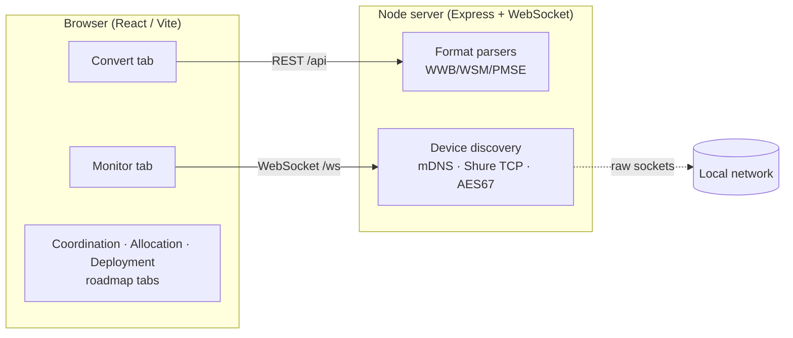

# RFutils

> **AI-assisted project.** This codebase was created with [Claude Code](https://claude.com/claude-code)
> (Anthropic), directed and reviewed by a human author. It merges three earlier tools into one
> package; several of the underlying formats and protocols are reverse-engineered from real exports
> and vendor gear rather than official schemas (neither Shure nor Sennheiser publish full specs for
> most of these). **Verify every export against your own WWB/WSM install, and check experimental
> outputs carefully, before relying on any of this for a live show.**

A browser-based RF-coordination and wireless-mic suite that unifies three separate tools into one
package, with room to grow into full frequency coordination, allocation, and deployment services:

| Merged tool | What it did | Where it lives now |
|---|---|---|
| [wsm-wwb-bridge](https://github.com/allansargeant/wsm-wwb-bridge) | Move coordination data between Shure Wireless Workbench (WWB) and Sennheiser Wireless Systems Manager (WSM), plus any CSV | **Convert › Coordination files** |
| [pmse-to-wwb](https://github.com/allansargeant/pmse-to-wwb) | Convert an Ofcom PMSE licence schedule PDF into WWB import files | **Convert › Ofcom PMSE licence** |
| [MicWizard](https://github.com/allansargeant/MicWizard) | Discover networked Shure/Sennheiser/AES67 receivers and monitor audio / battery / RF | **Monitor** |



Everything routes through **one internal channel model** (`packages/shared`), so any supported input
can be re-exported as any supported output, and the same model feeds the planned coordination tools.

## Architecture

An npm-workspaces monorepo:

- **`packages/shared`** — the internal data model and wire types shared by server and browser
  (`Channel` / `CoordinationList`, PMSE `Assignment`, `DiscoveredDevice`, the WebSocket protocol).
- **`packages/server`** — a Node ([Express](https://expressjs.com) + [ws](https://github.com/websockets/ws))
  server. It does the file parsing/exporting (ported from the two Python tools) **and** owns the raw
  sockets a browser can't open: mDNS, Shure's TCP command protocol, and AES67/SAP multicast.
- **`packages/web`** — the React/Vite single-page app (ported from MicWizard's renderer plus new
  conversion UI).

The two file tools were originally Python (a tkinter desktop app and a FastAPI service); their
parsers were ported to TypeScript and checked against the original tools' output on real sample
files (see `packages/server/scripts/verifyParsers.ts`). MicWizard's networking was already
TypeScript and moved from its Electron main process into this server largely intact.

## Running it

Requires Node 18+ (developed against Node 22/26).

```bash
npm install
npm run dev          # server on :8420, web on :5273 (Vite proxies /api and /ws to the server)
```

Then open http://localhost:5273.

For a production build served from a single port:

```bash
npm run build
npm start -w @rfutils/server   # serves the built UI + API on :8420
```

Other scripts: `npm run typecheck` (all packages), `npm test` (server parser tests).

### Environment

- `RFUTILS_SERVER_PORT` — server port (default `8420`).
- `RFUTILS_DISABLE_MONITOR=1` — skip network device discovery (file conversion still works).
- `RFUTILS_CONFIG_DIR` — where `companion-routes.json` is read from (default `~/.rfutils`).

## Convert

### Coordination files (WSM · WWB · CSV)

Drop a file and RFutils auto-detects its shape, previews the parsed channels, and lets you
re-export to any supported format:

**Reads:** Shure `.shw` / `.cws` (native WWB XML), Sennheiser `.wsm` project files, WSM HTML
"Coordination Report", WSM Frequencies/Bands CSV, WWB Coordination Report CSV, a bare frequency
list, or any other CSV via a column-mapping dialog.

**Writes:** WWB frequency list (`.txt`, the safe documented import format), WWB inventory CSV,
WSM Frequencies/Bands CSV, a generic CSV, or an experimental WWB7 `.shw` show file.

### Ofcom PMSE licence (PDF)

Upload an Ofcom PMSE licence schedule PDF to generate a WWB frequency list (`.txt`), a reference
sheet (`.csv`) mapping frequencies to suggested names and coordination groups, and an experimental
`.shw` show file.

> **PDF parsing.** The original `pmse-to-wwb` used Python's `pdfplumber` for table detection.
> `pdfjs-dist` has no table detector, so this port buckets positioned text into the fixed Ofcom
> ST16 template's columns (scaled by page width) and merges the multiple physical lines per row.
> It's been validated against a real Ofcom PMSE licence schedule — all 116 assignments,
> frequencies, sites, periods, fees and header metadata parse correctly. The column geometry is
> calibrated to that fixed template; a materially different Ofcom template revision would need
> re-calibration, so it's still wise to sanity-check the parsed assignments against the source PDF.

> ⚠️ The `.shw` show file (both here and in the coordination exporter) is reverse-engineered from a
> single real WWB7 file and unvalidated by Shure. Open it in Wireless Workbench and check it before
> relying on it for a real show; when in doubt, use the frequency list.

## Monitor

Live discovery and metering of wireless receivers on the local network — Shure (TCP command
strings, port 2202), Sennheiser (SSC), and AES67/Dante (mDNS + SAP), with per-channel audio,
battery, and RF telemetry pushed to the browser over WebSocket.

> **Not yet hardware-tested.** As in MicWizard, the vendor protocol adapters are built from a mix of
> public documentation and best-effort reverse engineering and have not been validated against real
> receivers. The Sennheiser SSC adapter in particular is a skeleton.

Unlike MicWizard (an Electron app), this is a web app: the server decodes AES67 and publishes
per-channel **levels**, but audio **cueing to headphones** — a MicWizard feature that ran in the
Electron renderer — is out of scope for the browser build, since a browser can't join a multicast
RTP group directly.

### Dante routing via Companion (optional)

Off by default. To route Dante crosspoints from the Monitor tab, run your own
[Bitfocus Companion](https://bitfocus.io/companion) with a single "Make Crosspoint" button wired to
`companion-module-audinate-dantecontroller`, then copy `companion-routes.example.json` to
`~/.rfutils/companion-routes.json` (or `$RFUTILS_CONFIG_DIR`). RFutils just sets four Companion
custom variables and presses your button — it has no Dante integration of its own, and full Dante
API control still requires Audinate's SDK (see `packages/server/src/monitor/audio/danteApi.ts`).

## Roadmap

The **Coordination**, **Allocation**, and **Deployment** tabs are placeholders for the services this
suite is being built to grow into — intermod-aware frequency coordination, assigning coordinated
frequencies to talent/receivers, and pushing them to the gear. The unified channel model and device
registry already powering Convert and Monitor are the foundation for those.
